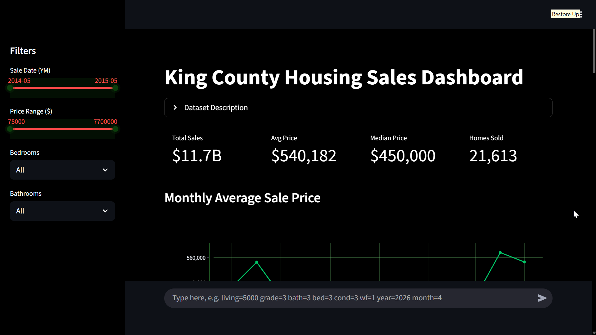
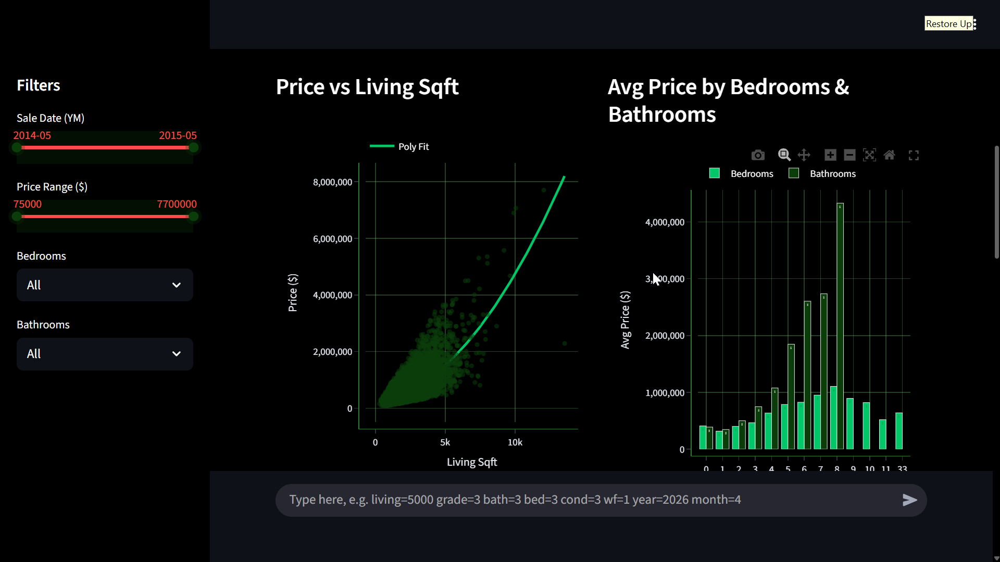
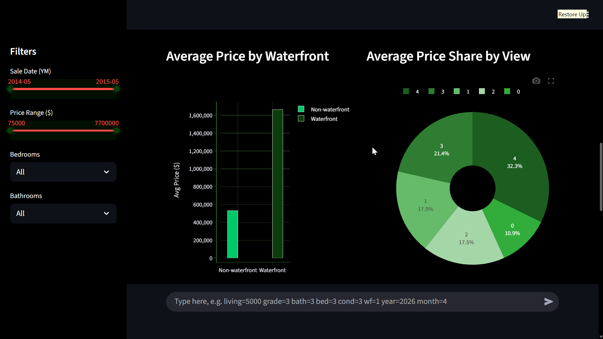
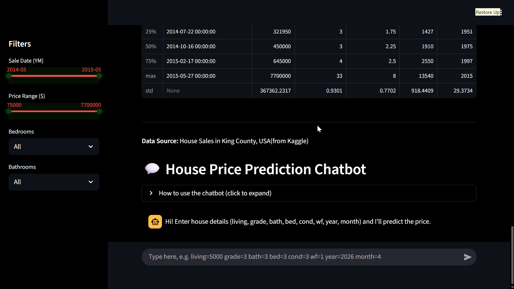

# King County Housing Sales Analysis & Prediction

# 1. Overview

This project analyzes house sales data in King County (USA) and builds a predictive model for estimating housing prices.  
It includes data exploration, visualization, preprocessing, regression modeling, and an interactive dashboard.

---

# 2. Exploratory Data Analysis (EDA)

- Distribution of house prices  
- Average prices by living area, bedrooms, and year built  
- Trend analysis over time  

---

# 3. Data Cleaning & Preprocessing

- Renamed columns for clarity  
- Converted dates & numerical values  
- Removed missing/duplicate records  
- Added log-transformed price feature  

---

# 4. Modeling

- Built an OLS regression model with key features:
  - sqft, grade, bedrooms, bathrooms, condition, waterfront, etc.  
- Evaluated model performance with:
  - R², RMSE, MAE, and accuracy metrics  
- Achieved price prediction with test-set validation  

---

# 5. Interactive Dashboard (Streamlit)

- Dark-themed UI with filters:
  - date, price range, bedrooms, bathrooms  
- KPIs:
  - total sales, average price, median price, homes sold  
- Visualizations:
  - Monthly average prices  
  - Price vs living area  
  - Price by bedrooms & bathrooms  
  - Price by waterfront & view  
- Data preview and summary statistics  

---

# 6. Price Prediction Chatbot

Users can enter house details

